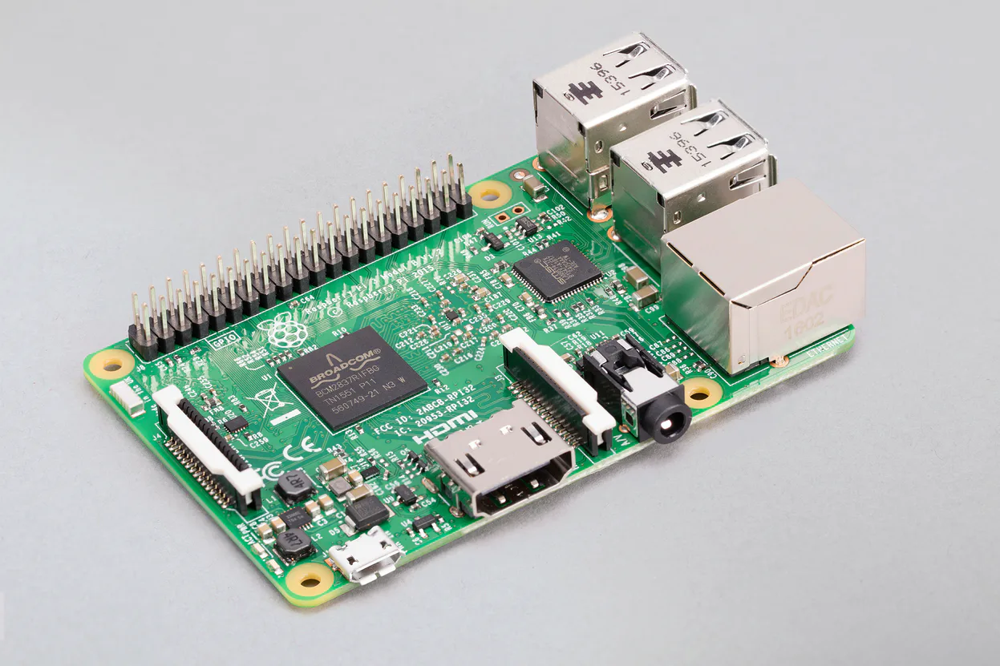

# Day 01 - Raspberry Pi setup 

Today I've setup my old Raspberry Pi that I will use to experiment on an ARM processor. Before going throught the setup I first took the time to search for some informations about the hardware of this board so let's start with that. 




Reading the Raspberry Pi official documentation, that's what we get inside the board:

- Quad Core 1.2GHz Broadcom BCM2837 64bit CPU
- 1GB RAM
- BCM43438 wireless LAN and Bluetooth Low Energy (BLE) on board
- 100 Base Ethernet
- 40-pin extended GPIO
- 4 USB 2 ports
- 4 Pole stereo output and composite video port
- Full size HDMI
- CSI camera port for connecting a Raspberry Pi camera
- DSI display port for connecting a Raspberry Pi touchscreen display
- Micro SD port for loading your operating system and storing data
- Upgraded switched Micro USB power source up to 2.5A


**🔎 Quad Core 1.2GHz Broadcom BCM2837 64bit CPU**

Yeah that's a beautiful name but it doesn't really tell much about the actual CPU that is inside, so I did some research about this BCM2837. It's in reality an ARM Cortex-A53 CPU ! 💡

When looking for it in [wikipedia](https://en.wikipedia.org/wiki/ARM_Cortex-A53) we can see the following:

> The **ARM Cortex-A53** is one of the first two [central processing units](https://en.wikipedia.org/wiki/Central_processing_unit) implementing the [ARMv8-A](https://en.wikipedia.org/wiki/ARMv8-A) 64-bit [instruction set](https://en.wikipedia.org/wiki/Instruction_set) designed by [ARM Holdings](https://en.wikipedia.org/wiki/ARM_Holdings)' [Cambridge](https://en.wikipedia.org/wiki/Cambridge) design centre. The Cortex-A53 is a 2-wide decode [superscalar processor](https://en.wikipedia.org/wiki/Superscalar_processor), capable of dual-issuing some instructions.
>
> ...
>
> Overview
>
> - 8-stage pipelined processor with 2-way [superscalar](https://en.wikipedia.org/wiki/Superscalar), in-order execution pipeline
> - DSP and [NEON](https://en.wikipedia.org/wiki/ARM_architecture#Advanced_SIMD_(NEON)) [SIMD](https://en.wikipedia.org/wiki/SIMD) extensions are mandatory per core
> - [VFPv4](https://en.wikipedia.org/wiki/VFP_(instruction_set)) [Floating Point Unit](https://en.wikipedia.org/wiki/Floating-point_unit) onboard (per core)
> - [Hardware virtualization](https://en.wikipedia.org/wiki/Hardware_virtualization) support
> - [TrustZone](https://en.wikipedia.org/wiki/ARM_architecture#Security_extensions) security extensions
> - 64-byte [cache lines](https://en.wikipedia.org/wiki/Cache_line)
> - 10-entry L1 [TLB](https://en.wikipedia.org/wiki/Translation_Lookaside_Buffer), and 512-entry L2 TLB
> - 4 KiB conditional [branch predictor](https://en.wikipedia.org/wiki/Branch_predictor), 256-entry indirect branch predictor

Great ! We have all we need ! We now know that this CPU supports advanced SIMD instruction (that will be useful for our matrix/vector operations optimisations) and a Floating Point Unit (that we will hopefully be able to use for floating points calculations). There is also a mentionned about "dual-issuing" which makes me suppose that it would be possible to issue two instructions at the same time to speed up our code but I will have to look in more detail.

## 1. Flashing the card with an OS

Ok so now let's talk about the OS that I've installed on the board. I won't go into to much details on that as it's pretty well documented on the web but I basically followed [this tutorial](https://www.raspberrypi.com/documentation/computers/getting-started.html).

I choosed to install Debian GNU/Linux 10 (buster). I don't know much about the criteria to choose an OS but it seemed that the Raspberry Pi OS is by default 32 bits (even on a 64 bits CPU) 🤔 so I went for the linux version.


## 2. Doing some setup

**Locally**

I've setup my SSH to connect to the board:

```
ssh-copy-id pi@<ip-address>
```

Added the board in my `.ssh/config`:

```
vim ~/.ssh/config

# on the file 
Host=raspi
   User=<username>
   Hostname=<ip-address>
```

**On the board**

I did the following to have everything up to date:

```
sudo apt update && sudo apt full-upgrade -y
```

Changed the hostname of the board:

```
sudo apt install vim
vim /etc/hostname
vim /etc/hosts (change all occurence of the old name to the new name)
```

I've setup a [Firewall](https://doc.ubuntu-fr.org/ufw)

```
sudo apt install ufw
sudo ufw allow 22 (allow incomming ssh connections)
sudo ufw show added (check that the rule has been added)
sudo ufw enable (enable the firewall)
sudo ufw status verbose (check the status of the firewall)
```

## 3. Raspberry Pi power supply

Overything went well but I realized it happened that I couldn't connect to SSH. I was getting the following error:

```
ssh: connect to host XXX.XXX.X.XXX port 22: Operation timed out
```

After looking a bit on the web, I discovered this could be due to a bad power supply so I decided to try to find a way to check if that was the root cause.

I found this [very interesting article](https://bia.is/2019/02/02/raspberry-pi-check-your-power-supply/) and after running the script that they provided I got exactly the log they were mentionning in the article saying that `Throttling has occurred, Under-voltage has occurred` 😭.

I ordered [this](https://www.amazon.fr/gp/product/B00PTLSH9G/ref=ppx_yo_dt_b_asin_title_o00_s00?ie=UTF8&psc=1) USB power hub that seems to be good. I will run the script when I will receive it to check that everything is OK 🔋🔌.


That's all for today ! Tomorrow I'll try to cross compile Rust code to run on the raspi 🦀


