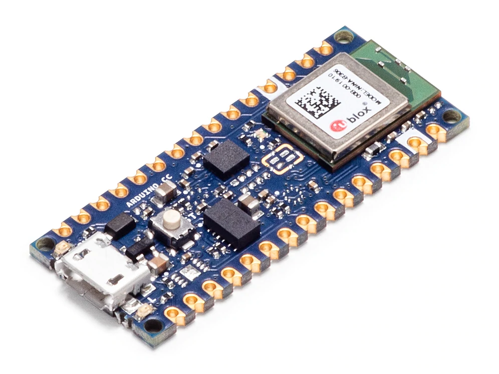

# Day 05 - Arduino nano 33 BLE setup 

Today it's time to discover the second board that I'll use for my projects, the **Arduino nano 33 BLE**. As I did for the Raspberry Pi, I started by looking for some informations on the hardware of the board.

Reading the Arduino official documentation, that's what we get inside the board:

- nRF52840 64MHz processor
- 256 KB SRAM, 1MB flash memory
- NINA-B306 Bluetooth
- LSM9DS IMU (Inertial Mesure Unit)
- MP34DT05 Microphone
- APDS9960 Gesture, Light, Proximity sensor
- LPS22HB Barometric pressure sensor
- HTS221 Temperature, humidity sensor
- UART, I2C, SPI connectivity

**🔎 nRF52840 64MHz MCU**

Now let's see what's inside the nRF52840 SoC !

From the [Nordic Semicontuctor website](https://www.nordicsemi.com/Products/nRF52840) (the designer of the chip) we can read that

> The nRF52840 is built around the 32-bit ARM® Cortex™-M4 CPU with floating point unit running at 64 MHz.

So the CPU of this board is an Arm Cortex-M4. With that information, I made some search on that particular CPU and I found the following informations.

> Conceptually the Cortex-M4 is a Cortex-M3 plus [DSP](https://en.wikipedia.org/wiki/Digital_signal_processor) instructions, and optional floating-point unit (FPU). A core with an FPU is known as Cortex-M4F.
>
> Key features of the Cortex-M4 core are:
>
> - ARMv7E-M architecture[[10\]](https://en.wikipedia.org/wiki/ARM_Cortex-M#cite_note-ARMv7-M-Manual-10)
> - 3-stage [pipeline](https://en.wikipedia.org/wiki/Pipeline_(computing)) with [branch speculation](https://en.wikipedia.org/wiki/Branch_predictor).
> - Instruction sets:
>   - Thumb-1 (entire).
>   - Thumb-2 (entire).
>   - 32-bit hardware integer multiply with 32-bit or 64-bit result, signed or unsigned, add or subtract after the multiply. 32-bit Multiply and MAC are 1 cycle.
>   - 32-bit hardware integer divide (2–12 cycles).
>   - [Saturation arithmetic](https://en.wikipedia.org/wiki/Saturation_arithmetic) support.
>   - DSP extension: Single cycle 16/32-bit [MAC](https://en.wikipedia.org/wiki/Multiply–accumulate_operation), single cycle dual 16-bit MAC, 8/16-bit [SIMD](https://en.wikipedia.org/wiki/SIMD) arithmetic.
> - 1 to 240 [interrupts](https://en.wikipedia.org/wiki/Interrupt), plus [NMI](https://en.wikipedia.org/wiki/Non-maskable_interrupt).
> - 12 cycle interrupt latency.
> - Integrated sleep modes.

Two things weren't that obvious to me:

- The AMRv7E-M architecture mention
- The `thumb-1`, `thumb-2` intructions sets mentioned

**ARMv7e-m architecture**

After searching a bit on the web, I saw that the ARMv7e-m architecture means that the CPU we deal with supports the classical ARMv7 instruction set plus some extensions. As mentionned [here](https://community.arm.com/arm-community-blogs/b/architectures-and-processors-blog/posts/armv6-m-vs-armv7-m---unpacking-the-microcontrollers):

> ARMv7E-M is currently supported by the [Cortex-M4](https://developer.arm.com/products/processors/cortex-m/cortex-m4) processor. It builds on ARMv7-M adding a set of saturating and SIMD instructions. This (called the “DSP extension”) significantly increases the capability of the core in DSP applications. These instructions cover operations like signed and unsigned saturated arithmetic, byte and halfword packing/unpacking, dual 16-bit and quad 8-bit operations, and extended halfword multiply-accumulate.

So that's a very good point as it seems that this CPU supports SIMD instructions that we will be able to leverage to make some optimisations on our code.

**Thumb instructions**

Here again google is my friend ! Behind this name, it's in reality a subset of the most commonly used 32-bit ARM instructions that have been encoded as 16 bits long instructions. 

Why is that important ? Because it can bring some perfomance optimisations (small instructions means smaller binaries and faster decoding). Here is what we can read from the [Arm official documentation](https://developer.arm.com/documentation/ddi0210/c/CACBCAAE):

> On execution, 16-bit Thumb instructions are transparently decompressed to full 32-bit ARM instructions in real time, without performance loss.
>
> Thumb has all the advantages of a 32-bit core:
>
> - 32-bit address space
> - 32-bit registers
> - 32-bit shifter, and *Arithmetic Logic Unit* (ALU)
> - 32-bit memory transfer.
>
> Thumb therefore offers a long branch range, powerful arithmetic operations, and a large address space.
>
> Thumb code is typically 65% of the size of ARM code, and provides 160% of the performance of ARM code when running from a 16-bit memory system. Thumb, therefore, makes the ARM7TDMI core ideally suited to embedded applications with restricted memory bandwidth, where code density and footprint is important.
>
> The availability of both 16-bit Thumb and 32-bit ARM instruction sets gives designers the flexibility to emphasize performance or code size on a subroutine level, according to the requirements of their applications. For example, critical loops for applications such as fast interrupts and DSP algorithms can be coded using the full ARM instruction set then linked with Thumb code.

Great, that's a lot of intersting informations but how can we setup this board to run some Rust code ? 🤔

I've started to take a look and it doesn't seems so simple for two reasons:

- The board is an Arduino one flashed with the Arduino proprietary bootloader and I didn't found much informations about how to flash custom binaries without using the Arduino SDK
- The board doesn't include an onboard debugging chip so we cannot directly access the CPU debugging interface to flash and debug code by our self

I didn't have time this morning to go deeper but from what I found the best approach seems to do the following:

- Use a raspberry Pi pico to emulate a JTAG/SWD probe
- Do the right branching to connect the Arduino nano 33 ble debug pins to the pico board
- Use [OpenOCD](https://openocd.org/pages/about.html) as a debugging interface

More on that tomorrow ! 😉