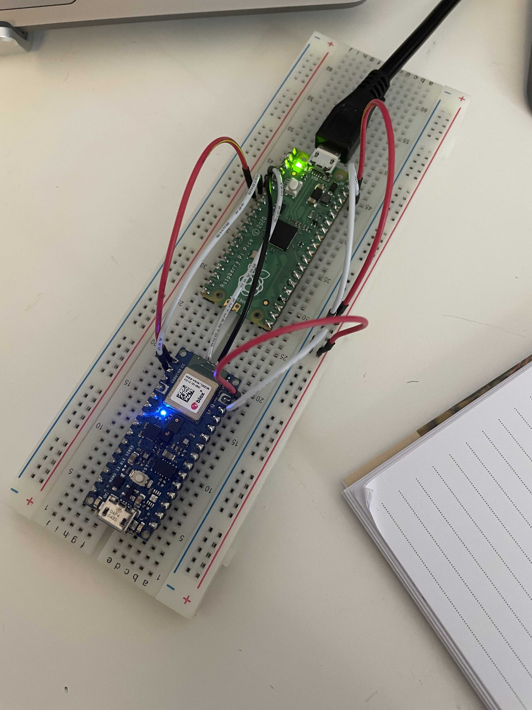

# Day 9 - Programming Arduino 33 BLE without bootloader

Today I decided to try to flash my Arduino Nano 33 BLE without using the default Arduino Bootloader and directly use the SWD debug ports of the board.

## What is the SWD port

The Serial Wire Debug is an interface on the board that a programmer can use to access device memory and CPU informations at anytime during runtime, in other words it allows you to debug your code live.

> Serial Wire Debug (SWD) provides a debug port for severely pin-limited packages, often the case for small package microcontrollers but also complex ASICs, where limiting pin count is critical and can be the controlling factor in device costs.
>
> SWD replaces the 5-pin JTAG port with a clock + single bi-directional data pin, providing all the normal JTAG debug and test functionality plus real-time access to system memory without halting the processor or requiring any target resident code. SWD uses an Arm standard bi-directional wire protocol, defined in the Arm Debug Interface v5, to pass data to and from the debugger and the target system in a highly efficient and standard way. 

However, contrary to some other board, the Arduino nano 33 ble is not equiped with an on board debugger that would allow use to directly get access to that interface using USB. Instead, we need to connect a debug probe to it that will be in charge do handle the communication between the board and the debugger on our host through USB.

When looking on the web for this king of device (commonly called probes) I saw they are quite expensive:

- https://shop.segger.com/debug-trace-probes/debug-probes/?p=1
- https://www.elektor.com/black-magic-probe-v2-1-jtag-swd-arm-debugger

Luckily, I've found some articles explaining how to turn a Raspberry Pi pico into a debug probe without too much hassle 😍

## Use a Raspberry Pi pico as a debug probe

Here are the articles I've found on the topic:

- [Using a rapsberry Pi as a debug probe for nRF52840](https://community.element14.com/products/roadtest/b/blog/posts/tutorial-02-part-2-debugging-nrf52840-using-raspberry-pi-arduino-nano-33-ble-sense-roadtest)
- https://blog.smittytone.net/2021/02/05/how-to-debug-a-raspberry-pi-pico-with-a-mac-swd/

## Let's try it ! 

I reused the same example project from yesterday but this time I flashed it using the raspberry pi pico probe and `openocd`

